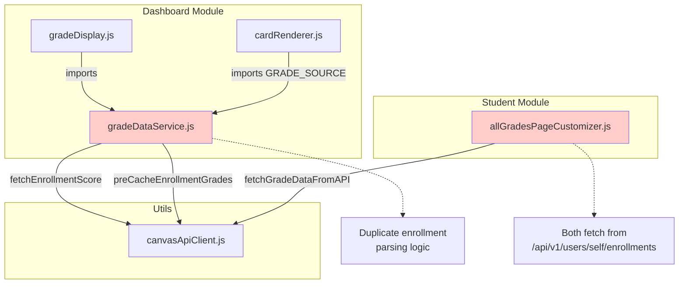
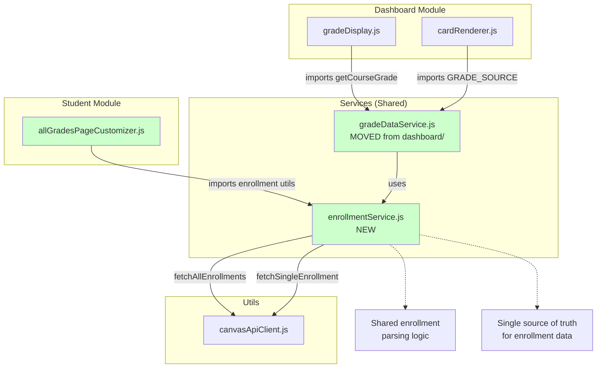
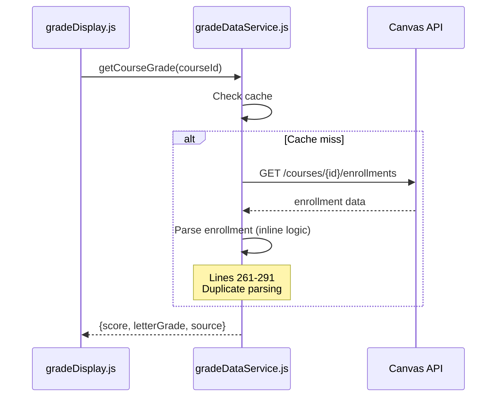
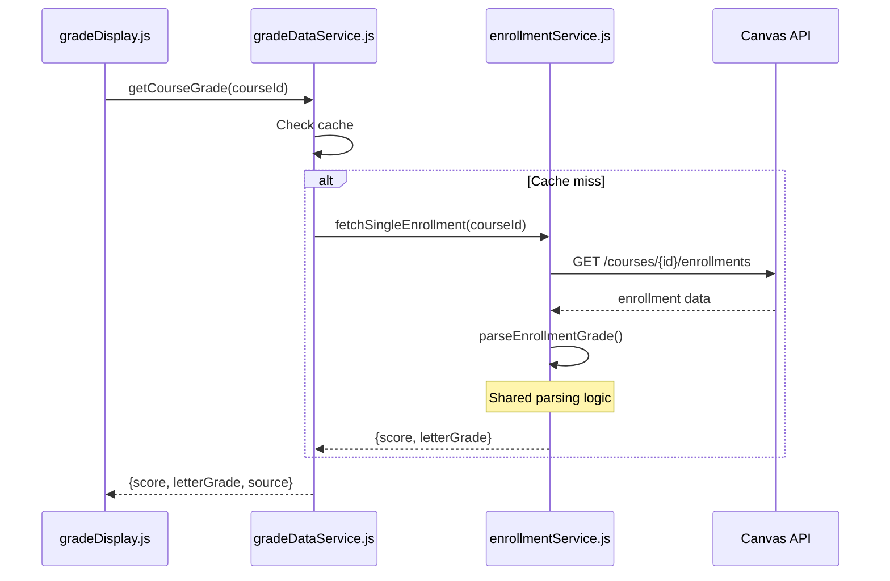
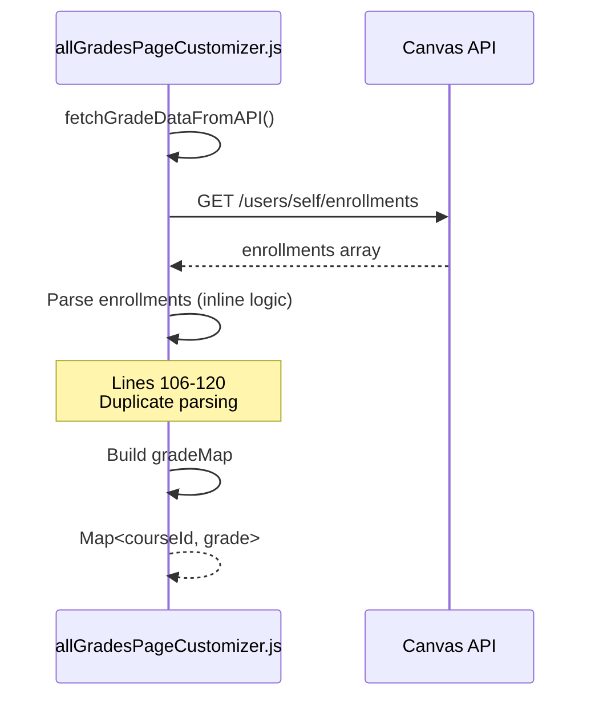
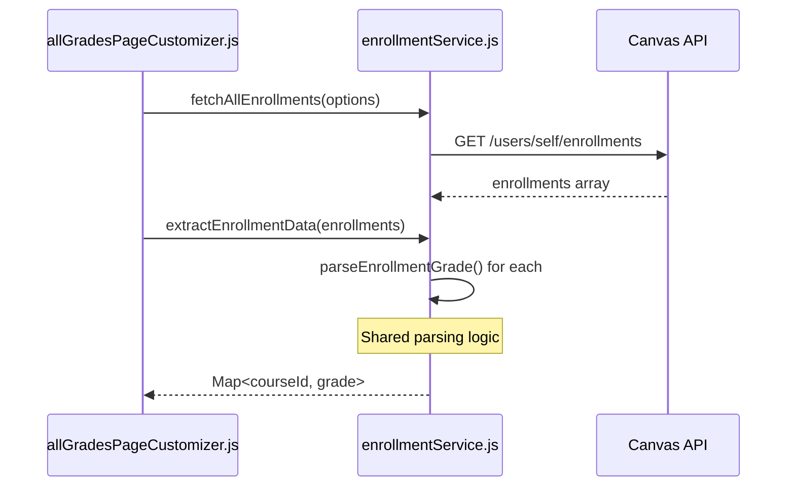

# Phase 4: Grade Data Service Consolidation - Architecture Diagram

## Current Architecture (Before Refactoring)



**Problems:**
- 🔴 `gradeDataService.js` in `dashboard/` but needed by student module
- 🔴 Duplicate enrollment parsing in `gradeDataService.js` (2 places)
- 🔴 Duplicate enrollment fetching in `allGradesPageCustomizer.js`
- 🔴 ~105 lines of duplicate code

---

## Proposed Architecture (After Refactoring)



**Benefits:**
- ✅ `gradeDataService.js` in `services/` (accessible to all modules)
- ✅ Shared enrollment parsing in `enrollmentService.js`
- ✅ Both modules use same enrollment utilities
- ✅ ~105 lines of duplicate code removed

---

## Data Flow Comparison

### Before: Dashboard Grade Fetching



### After: Dashboard Grade Fetching



---

### Before: All-Grades Page Fetching



### After: All-Grades Page Fetching



---

## Module Dependencies

### Before

```
src/dashboard/gradeDataService.js
├── Imports: canvasApiClient.js, logger.js, config.js
├── Exports: getCourseGrade, preCacheEnrollmentGrades, GRADE_SOURCE
└── Used by: gradeDisplay.js, cardRenderer.js

src/student/allGradesPageCustomizer.js
├── Imports: canvasApiClient.js, logger.js, courseDetection.js
├── Internal: fetchGradeDataFromAPI() - duplicate logic
└── Used by: studentGradeCustomization.js
```

### After

```
src/services/enrollmentService.js (NEW)
├── Imports: canvasApiClient.js, logger.js
├── Exports: parseEnrollmentGrade, fetchAllEnrollments, 
│            fetchSingleEnrollment, extractEnrollmentData
└── Used by: gradeDataService.js, allGradesPageCustomizer.js

src/services/gradeDataService.js (MOVED)
├── Imports: enrollmentService.js, canvasApiClient.js, logger.js, config.js
├── Exports: getCourseGrade, preCacheEnrollmentGrades, GRADE_SOURCE
└── Used by: gradeDisplay.js, cardRenderer.js

src/student/allGradesPageCustomizer.js
├── Imports: enrollmentService.js, canvasApiClient.js, logger.js
├── Removed: fetchGradeDataFromAPI() - uses shared service
└── Used by: studentGradeCustomization.js
```

---

## Code Reduction Visualization

### Enrollment Parsing Logic

**Before**: Duplicated in 3 places
```
gradeDataService.js (lines 108-132)    ████████████████████ 25 lines
gradeDataService.js (lines 261-291)    ██████████████████████████████ 31 lines
allGradesPageCustomizer.js (106-120)   ███████████████ 15 lines
                                       ─────────────────────────────────
                                       Total: 71 lines
```

**After**: Centralized in 1 place
```
enrollmentService.js::parseEnrollmentGrade()  ████████████████████ 25 lines
                                              ─────────────────────────────────
                                              Total: 25 lines
                                              Saved: 46 lines (65% reduction)
```

### Enrollment Fetching Logic

**Before**: Separate implementations
```
gradeDataService.js::fetchEnrollmentScore()   ████████████████████████ 30 lines
allGradesPageCustomizer.js::fetchGradeData()  ████████████████████████ 30 lines
                                              ─────────────────────────────────
                                              Total: 60 lines
```

**After**: Shared utilities
```
enrollmentService.js::fetchSingleEnrollment() ████████████ 15 lines
enrollmentService.js::fetchAllEnrollments()   ████████████ 15 lines
enrollmentService.js::extractEnrollmentData() ████████████ 15 lines
                                              ─────────────────────────────────
                                              Total: 45 lines
                                              Saved: 15 lines (25% reduction)
```

**Total Code Reduction**: ~105 lines removed (~58% reduction in enrollment-related code)

---

## File Structure Changes

### Before
```
src/
├── dashboard/
│   ├── gradeDataService.js ← Located here (dashboard-specific)
│   ├── gradeDisplay.js
│   └── cardRenderer.js
├── student/
│   └── allGradesPageCustomizer.js ← Duplicate enrollment logic
└── services/
    ├── assignmentService.js
    ├── outcomeService.js
    └── rubricService.js
```

### After
```
src/
├── dashboard/
│   ├── gradeDisplay.js
│   └── cardRenderer.js
├── student/
│   └── allGradesPageCustomizer.js ← Uses shared service
└── services/
    ├── assignmentService.js
    ├── outcomeService.js
    ├── rubricService.js
    ├── enrollmentService.js ← NEW: Shared enrollment utilities
    └── gradeDataService.js  ← MOVED: Now accessible to all modules
```

